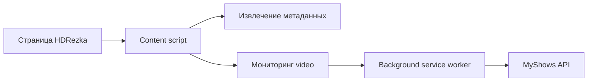

# MyShows Web Scrobbler

Браузерное расширение — аналог [myshows-scrobbler](https://github.com/myshowsme/myshows-scrobbler) для веб-плееров. Отслеживает просмотр на HDRezka и других сайтах и отправляет прогресс в [MyShows.me](https://myshows.me).

## Возможности

- Автоматический скробблинг серий и фильмов при просмотре в браузере
- Поддержка HDRezka и зеркал (любой домен с `rezka` в названии)
- Тот же API, что и у десктопного скробблера: `POST /start`, `/pause`, `/stop`
- Настраиваемый порог отметки «просмотрено» (по умолчанию 80%)
- Popup с текущим воспроизведением и автосопоставлением с MyShows
- Страница управления сопоставлениями (ручные и автоматические)

## Установка (разработка)

```bash
npm install
npm run build
```

Затем в Chrome:

1. Откройте `chrome://extensions`
2. Включите «Режим разработчика»
3. «Загрузить распакованное расширение» → папка `dist`

## Сборка и релизы

GitHub Actions автоматически:

- **Build** — на каждый push/PR в `main`: typecheck, сборка, артефакт `dist/` (14 дней)
- **Release** — при push тега `v*`: zip-архив расширения в [GitHub Releases](https://github.com/LuckyValenok/myshows-web-scrobbler/releases)

```bash
# Локально собрать zip
npm run package

# Опубликовать релиз
git tag v0.1.0
git push origin v0.1.0
```

Скачанный zip распакуйте и загрузите в Chrome как распакованное расширение, либо перетащите в `chrome://extensions`.

## Настройка

1. Откройте настройки расширения
2. Вставьте [токен MyShows](https://myshows.me/profile/watch-history/)
3. Нажмите «Проверить токен»
4. Начните смотреть серию на HDRezka — прогресс появится в popup

## Как это работает



1. **Content script** на странице извлекает название, сезон, серию, ID Кинопоиска
2. **Video monitor** следит за `<video>` (включая iframe-плееры)
3. **Background** управляет сессией: start → pause → stop при достижении порога
4. **MyShows** сопоставляет контент и отмечает просмотр

## Добавление нового сайта

Создайте адаптер в `src/sites/`:

```typescript
export const mySiteAdapter: SiteAdapter = {
  name: 'mysite',
  matches: (hostname) => hostname.includes('example.com'),
  extractMetadata(doc, url) { /* ... */ },
}
```

Зарегистрируйте его в `siteAdapters` в `src/sites/hdrezka.ts`.

## Лицензия

MIT
